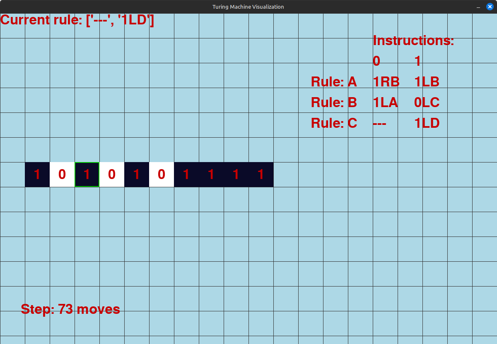

# Turing Machine

A simple implementation of a Turing Machine simulator with Python3, and Pygame visualisation.

## Features

- Simulate Turing Machines with customizable states
- Step-by-step execution and visualization
- Front-end GUI

## Requirements
There are no requirements for using the `TuringMachine` class. 

For the GUI front-end, `pygame` is required. 

## Front-end Visualisation
To execute the GUI, run `frontend.py` 



## Class Usage

The class `TuringMachine` can be found in `turing.py`, with the following usage:

```python
from turing import TuringMachine

instruction = [
    ['1RB', '1LB'],
    ['1LA', '0LC'],
    ['---', '1LD'],
    ['1RD', '0RA']
] # BB(4) champion; should halt after BB(4)=107 steps
tm = TuringMachine(instruction)

print(repr(tm))
while not tm.done:
    print(repr(tm))
    tm.next_move()

print(repr(tm))
```

## Contributing

Contributions are welcome! Please open issues or submit pull requests.

## License

This project is licensed under the MIT License.